<!--
 * @Author: lqm283
 * @Date: 2022-02-23 15:49:09
 * @LastEditTime: 2022-02-23 16:59:31
 * @LastEditors: lqm283
 * --------------------------------------------------------------------------------------------------------------------<
 * @Description: Please edit a descrition about this file at here.
 * --------------------------------------------------------------------------------------------------------------------<
 * @FilePath: \front-end\JavaScript.md
-->

# 初始 JavaScript

## JS 的组成



JS 基础学的是 JavaScript 语法
JS API 学的是 DOM 和 BOM

1. ECMAScript 是由 ECMA 国际（原欧洲计算机制造商协会）进行标准化的一门编程语言，这种语言在万维网上应用广泛，它往往被称为JavaScript 或 JScript，但实际上后两者是 ECMAScript 语言的实现和扩展。
2. DOM--文档对象模型
   文档对象模型 (Document Object Model,简称 DOM)，是 W3C 组织推荐的处理可扩展标记语言的标准编程接口。通过 DOM 提供的接口可以对页面上的各种元素进行操作（大小、位置、颜色等）。
3. BOM -- 浏览器对象模型
   BOM(Browse Object Model,简称 BOM) 是指浏览器对象模型，它提供了独立于内容的、可以和浏览器窗口进行互动的对象结构。通过 BOM 可以操作浏览器窗口，比如弹出框、控制浏览器跳转、获取分辨率等。

## JS 的三种写法

JS 有 3 种 书写位置，分别为行内、内嵌和外部。

### 行内式 JS

```html
\<input type = "button" value = "点我试试" onclick = "alert('Hello world')" />
```

+ 可以将单行或少量 JS 代码写在 HTML 标签的事件属性中（以 on 开头的属性），如：onclick
+ 注意单双引号的使用：在 HTML 中我们推荐使用双引号，JS 中我们推荐使用单引号。
+ 可读性差，在 HTML 中编写大量代码时，不方便阅读。
+ 引号易错，引号多层嵌套匹配时，非常容易弄混。
+ 特殊情况下使用。

### 内嵌 JS

```html
\<script>
    alert('Hello world')
\</script>
```

+ 可以将多行 JS 代码写到 \<script\> 标签中
+ 内嵌 JS 是学习时常用的方式

### 外部 JS 文件

```html
\<script src="my.js"> \</script>
```

+ 利于 HTML 页面结构化， 把大段 JS  代码独立到 HTML 页面之外，既美观，也方便文件级别的服用
+ 引用外部 JS 文件的 script 标签中间不可以写代码
+ 适合于 JS 代码量比较大的情况

## JS 注释

注释方式和 C 语言一致

## JS 的输入和输出语句

为了方便信息的输入输出，JS中提供了一些输入输出语句，其常用的语句如下：

|   方法   |   说明   |  归属  |
| :---------: | :------: | :------: |
|alert(msg)|浏览器弹出警示框|浏览器|
|console.log(msg)|浏览器控制台打印输出信息|浏览器|
|prompt(info)|浏览器弹出输入框，用户可以输入|浏览器|

# 变量

## 变量的使用

1. 声明变量

   ```js
    var age;  //声明一个名称为age的变量
    var a = 9; //在声明时初始化
   ```

2. 赋值

    ```js
     age = 18;
    ```
