<!--
 * @Author: lqm283
 * @Date: 2022-02-12 11:46:12
 * @LastEditTime: 2022-02-19 16:00:14
 * @LastEditors: lqm283
 * --------------------------------------------------------------------------------------------------------------------<
 * @Description: Please edit a descrition about this file at here.
 * --------------------------------------------------------------------------------------------------------------------<
 * @FilePath: \front-end\css.md
-->

# CSS简介

1. HTML主要做结构，显示元素内容
2. CSS美化HTML，布局网页
3. CSS最大价值：由HTML专注去做结构呈现，样式交给CSS，即结构（HTML）与样式相分离。

# CSS语法规范

使用HTML时，需要遵从一定的规范，CSS也是如此。要想熟练地使用CSS对网页进行修饰，首先需要了解CSS样式规则。

CSS规则由两个主要的部分构成：选择器以及一条或多条声明。

+ 选择器是用于指定CSS样式的HTML标签，花括号内是对该对象设置的具体样式
+ 属性和属性值以“键值对”的形式出现
+ 属性是对指定的对象设置的样式属性，例如字体大小、文本颜色等
+ 属性和属性值之间用英文":"分开
+ 多个“键值对”之间用英文";"进行区分

# CSS代码风格

以下代码书写疯狂不是强制规范，而是符合实际开发书写方式

1. 样式格式书写

    使用展开的方式书写

    ```css
    h3{
        color:pingk;
        font-size:20px;
    }
    ```

2. 样式大小写

    选择器、属性名、属性值关键字全部使用小写字母，特殊情况除外。

    ```css
    h3 {
        color:pink;
    }
    ```

3. 空格规范

    ```css
    h3 {
        color: pink;
    }
    ```

    ① 属性前面，冒号后面，保留一个空格
    ② 选择器（标签）和大括号中间保留空格

# CSS基础选择器

## CSS选择器的作用

选择器（选择符）就是根据不同需求把不同的标签选出来，这就是选择器的作用。简单来说，就是选择标签用的。



以上CSS做了两件事：

1. 找到所有的h1标签。选择器（选对人）。
2. 设置这些标签的样式，比如颜色为红色（做对事）。

## 选择器分类

选择器分为基础选择器和复合选择器两个大类。

+ 基础选择器是由单个选择器组成的
+ 基础选择器又包括：标签选择器、类选择器、id选择器和通配符选择器

### 标签选择器

标签选择器（元素选择器）是指用HTML标签名称作为选择器，按标签名称分类，为页面中某一类标签指定统一的CSS样式。

语法：

```css
标签名 {
    属性1: 属性值1;
    属性2: 属性值2;
    属性3: 属性值3;
    ...
}
```

#### 作用

标签选择器可以某一类标签全部选择出来，比如所有的\<div>标签和所有的\<span>标签

#### 优点

能快速为页面中同类型的标签统一设置样式

#### 缺点

不能设计差异化样式，只能选择全部的当前标签

### 类选择器

如果想要差异化选择不同的标签，单独选一个或者某几个标签，可以使用类选择器。

类选择器在HTML中以class属性表示，在CSS中，类选择器以一个点"."号显示。

语法：

```css
.类名 {
    属性1: 属性值1;
    ...
}
```

例如，将所有用于red类的HTML元素均为红色。

```css
.red {
    color: red;
}
```

**注意：**

+ 类选择器使用"."（英文点号）进行标识，后面紧跟类名（自定义，我们自己命名的）。
+ 可以理解为给这个标签起了一个名字来表示。
+ 长名称或词组可以使用中横线来为选择器命名。

    ```css
    .star-sing {
        color: green;
    }
    ```

+ 不要使用纯数字、中文等命名，尽量使用英文字母来表示。
+ 命名要有意义，尽量使别人一眼就知道这个类名的目的。

类选择器的的口诀：样式点定义，结构类（class）调用，一个或多个，开发最常用

#### 多类名

我们可以给一个标签指定多个类名，从而达到更多的选择目的。这些类名都可以选出这个标签。

简单理解就是一个标签有多个名字。

1. 多类名使用方式

   + 在标签class属性中写多个类名
   + 多个类名中间必须用空格分开

    ```css
    \<div class="red font20">亚瑟\</div>
    ```

2. 多类名的使用场景

   + 可以把一些标签元素相同的样式（共同的部分放到一个类里面）。
   + 这些标签都可以调用这个公共的类，然后再调用自己独有的类。

### id选择器

id选择器可以为标有特定id的HTML元素指定特定的样式。

HTML元素以id属性来设置id选择器，CSS中id选择器以"#"来定义。

语法：

```css
#id名 {
    属性1: 属性值1;
    ...
}
```

例如，将id为nav的元素中的内容设置为红色。

```css
#nav {
    color: red;
}
```

#### id选择器和类选择器的区别

1. 类选择器(class)好比人的名字，一个人可以有多个名字，同时一个名字也可以被多个人使用。
2. id选择器好比人的身份证号码，全国唯一的，不可以重复
3. id选择器和类选择器最大的不容在于使用次数上
4. 类选择器在修改样式中用得最多，id选择器一般用于页面唯一性的元素上，经常和JavaScript搭配使用。
5. id选择器的优先级比类选择器更高。

id选择器只能在一个位置被调用一次。

### 通配符选择器

在CSS中，通配符选择器使用"*"定义，它表示选取页面中所有元素（标签）。

语法

```css
    * {
        属性1：属性值1;
        ...
    }
```

+ 通配符选择器不需要调用，自动就给所有的元素使用样式
+ 特殊情况才使用。

## 基础选择器总结

|  基础选择器   |   作用   |    特点  |    使用情况   |       用法     |
| :---------: | :------: | :-----: | :------------: | :--------------: |
|标签选择器|可以选出所有相同的标签，比如p|不能差异化选择|较多|p {clolor: red;}|
|类选择器|可以选出一个或多个标签|可以根据需求选择|非常多|.nav {color: red;}|
|id选择器|一次只能选择一个标签|id属性只能在每个HTML  文档中出现一次|一般和js搭配使用|#nav {color: red;}|
|通配符选择器|选择所有标签|选择的太多，有部分不需要|特殊情况使用|* {color: red;}|

+ 每个基础选择器都有使用场景，都需要掌握
+ 如果是修改样式，类选择器是使用最多的

# CSS字体属性

CSS Fonts（字体）属性用于定义字体系列、大小、粗细和文字样式（如斜体）。

## 字体系列

CSS 使用font-family属性定义文本的字体系列。

```css
p {font-family: "微软雅黑"}
div (font-family: Arial,"Microsoft Yahei","微软雅黑")
```

+ 各种字体之间必须使用英文状态下的逗号隔开
+ 一般情况下，如果有空格隔开的多个单词组成的字体，加引号
+ 尽量使用系统默认自带字体，保证在任何用户的浏览器中都能正确显示
+ 最常见的几个字体："Microsoft Yahei"，tahoma,arial,"Hiragino Sans GB"

## 字体大小

CSS 使用 font-size 属性定义字体大小。

```css
p{
    font-size: 20px;
}
```

+ px(像素) 大小是我们网页的最常用的单位
+ 谷歌浏览器默认的文字大小为16px
+ 不同浏览器可能默认显示的自豪大小不一致，我们尽量给一个明确值大小，不要默认大小。
+ 可以给body指定整个页面文字的大小。

## 字体粗细

CSS 使用font-weight属性设置文字的粗细。

|  值   |   说明   |
| :---------: | :------: |
|normal|正常粗细。与400等值。|
|bold|加粗。 与700等值。|
|lighter|比从父元素继承来的值更细(处在字体可行的粗细值范围内)。|
|bolder|比从父元素继承来的值更粗 (处在字体可行的粗细值范围内)。|
|\<number\>|一个介于 1 和 1000 (包含) 之间的 \<number> 类型值。更大的数值代表字体重量粗于更小的数值 (或一样粗)。一些常用的数值对应于通用的字体重量名称，如章节常见粗细值名称和数值对应所描述。|

## 文字样式

CSS 使用 font-style 属性设置文本的风格

```css
P {
    font-style: normal;
}
```

|  值   |   说明   |
| :---------: | :------: |
|normal|默认值，浏览器会显示标准的字体样式 font-style: normal|
|italic|浏览器会显示斜体的字体样式|

## 字体复合属性

字体属性可以把文字样式综合来写，这样可以更节约代码

```css
body {
    font: font-style font-weight font-size/line-height font-family;
}
```

+ 使用font属性时，必须按上面语法格式中的顺序书写，不能更换顺序，并且各个属性间以空格隔开。
+ 不需要设置的属性可以省略(取默认值)，但必须保留font-size和font-family属性，否则font属性将不起作用。

# CSS文本属性

CSS Text（文本）属性可定义文本的外观，比如文本的颜色、对齐文本、装饰文本、文本缩进、行间距等。

## 文本颜色

color 属性用于定义文本的颜色

```css
div {
    color: red;
}
```

|  表示方式   |   属性值   |
| :---------: | :------: |
|预定义的颜色值|red,green,blue ...|
|十六进制|#ff0000, #ff6600, #29d794|
|RGB代码|rgb(255,0,0)或rgb(100%，0%，0%)|

## 对齐文本

text-align 属性用于设置元素内文本内容的水平对齐方式。

```css
div {
    text-align: center;
}
```

|  属性值   |   说明   |
| :---------: | :------: |
|left|左对齐（默认值）|
|right|右对齐|
|center|居中对齐|

## 装饰文本

text-decoration 属性规定添加到文本的修饰。可以给文本添加下划线、删除线、上划线等。

```css
div {
    text-decoration: underline;
}
```

|  表示方式   |   属性值   |
| :---------: | :------: |
|none|默认，没有装饰线|
|underline|下划线。链接a自带下划线(常用)|
|overline|上划线|
|line-through|删除线|

## 文本缩进

text-indent属性用来指定文本的第一行的缩进，通常是将段落的首行缩进。

```css
div {
    text-indent: 10px;
}
```

通过设置该属性，所有元素的第一行都可以缩进一个给定的长度，甚至该长度可以是负值。

```css
p {
    text-indent: 2em;
}
```

em是一个相对单位，就是当前元素(font-size)1个文字的大小，如果当前元素没有设置大小，则会按照父元素的1个文字大小。

## 行间距

line-height属性用于设置行间的距离(行高)。可以控制文字行与行间的距离。

```css
p {
    line-height: 26px;
}
```
